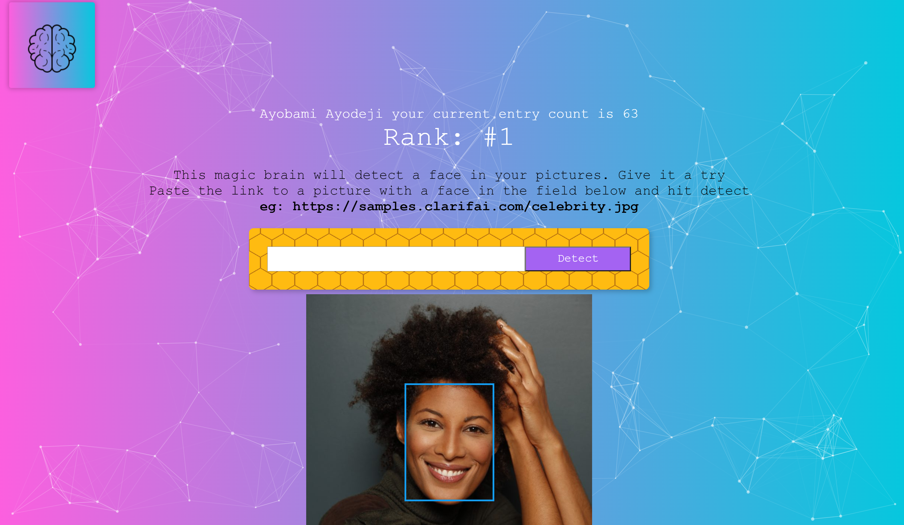

# SmartBrain
Website that allows you to upload a picture and it detects where the face is in the picture using ML



## Getting started - AKSC

We can leverage [AKS Construction](https://github.com/Azure/Aks-Construction) to quickly create a suitable environment with AKS cluster and Azure Appplicaton Gateway.

```azurecli
az group create -n smartbrain -l eastus
az deployment group create -g smartbrain -u https://aka.ms/aksc/json -p https://raw.githubusercontent.com/Azure/AKS-Construction/main/.github/workflows_dep/regressionparams/managed-public.json -p resourceName=smartbrain CreateNetworkSecurityGroups=false
```

After cluster creation we can install the application onto the cluster

```bash
az aks get-credentials -g smartbrain -n aks-smartbrain --overwrite-existing
cd k8s
kubectl apply -f .
```

