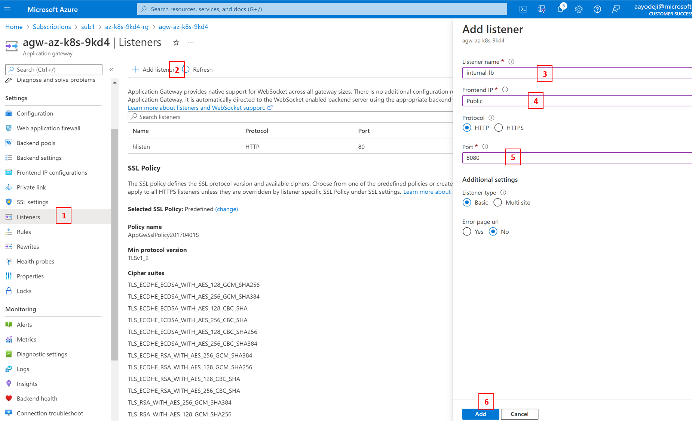
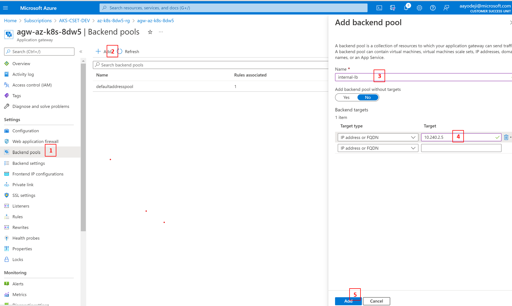

# Stage 2: Deploy a SmartBrain web app to AKS Landing Zone
ContosAI is a (fictional) artificial intelligence (AI) startup specializing in computer vision. They leverage machine learning and deep neural networks to identify and analyze images and videos. The company offers its solution via API, mobile SDK, and on-premise solutions. To showcase their cutting edge ML models, they are developing a customer facing application whereby customers can sign-up, provide images, and watch ContosAI's face detection model detect the faces in the model. The app is gamified by storing the number of times a user has used the face detector. It ranks the user compared with other users. ContosAI is planning to use the application to showcase their capabilities. They plan to host this new workload on in AKS.

## Prerequisite
To complete this, you need an AKS Landing Zone. If you haven't done so already, follow the steps in the [Deploy and Smartbrain app](../simpleapp/README.md) stage without completing the **Deploy the workload** part.

You will also need to install [helm](https://helm.sh/docs/intro/install/)

## Get started

The architecture of the application after deployment will look like the picture below
.

## Install the application
After cluster creation we can install the application onto the cluster

```bash
az aks get-credentials -g smartbrain -n aks-smartbrain --overwrite-existing
```

If you havent yet, clone the repo
```bash
git clone https://github.com/mosabami/smartbrain
```
## Install NGINX
This app doesnt work well with AGIC, so we will be using NGINX

Note: We will be using an internal load balancer here. Ensure the loadBalancerIP parameter in the command below is an ip address from the same subnet as your AKS cluster. If it isnt, use another unused internal ip address. 

```bash
ACRNAME=<Container registry name>
ACR_URL=<REGISTRY_URL>
```

```bash
SOURCE_REGISTRY=k8s.gcr.io
CONTROLLER_IMAGE=ingress-nginx/controller
CONTROLLER_TAG=v1.2.1
PATCH_IMAGE=ingress-nginx/kube-webhook-certgen
PATCH_TAG=v1.1.1
DEFAULTBACKEND_IMAGE=defaultbackend-amd64
DEFAULTBACKEND_TAG=1.5

az acr import --name $ACRNAME --source $SOURCE_REGISTRY/$CONTROLLER_IMAGE:$CONTROLLER_TAG --image $CONTROLLER_IMAGE:$CONTROLLER_TAG
az acr import --name $ACRNAME --source $SOURCE_REGISTRY/$PATCH_IMAGE:$PATCH_TAG --image $PATCH_IMAGE:$PATCH_TAG
az acr import --name $ACRNAME --source $SOURCE_REGISTRY/$DEFAULTBACKEND_IMAGE:$DEFAULTBACKEND_TAG --image $DEFAULTBACKEND_IMAGE:$DEFAULTBACKEND_TAG
```

You will be using a loadbalancer service with your ingress controller. for better security, we are using an load balancer with an internal ip. Modify the internal-ingress.yaml file so that it has an ip address from your AKS cluster's subnet. If you followed the instructions so far, `10.240.2.5` should work.

```bash
code internal-ingress.yaml
```

# Use Helm to deploy an NGINX ingress controller
```bash
cd ./smartbrain/k8s
```

```bash
# Create a namespace for your ingress resources
kubectl create namespace ingress-basic

# Add the ingress-nginx repository
helm repo add ingress-nginx https://kubernetes.github.io/ingress-nginx

# Use Helm to deploy an NGINX ingress controller
helm install nginx-ingress ingress-nginx/ingress-nginx \
    --namespace ingress-basic \
    -f internal-ingress.yaml \
    --set controller.replicaCount=2 \
    --set controller.nodeSelector."beta\.kubernetes\.io/os"=linux \
    --set defaultBackend.nodeSelector."beta\.kubernetes\.io/os"=linux \
    --set controller.admissionWebhooks.patch.nodeSelector."beta\.kubernetes\.io/os"=linux 
```
<!-- Deploy the required resources to make nginx work for Azure
```bash
kubectl apply -f https://raw.githubusercontent.com/kubernetes/ingress-nginx/controller-v1.2.1/deploy/static/provider/cloud/deploy.yaml
``` -->

### Configure Back end pool to point to Nginx

You will be using NGINX ingress controller with an internal IP address for this deployment. To make the application more secure, you will make app gateway with a web application firewall the entry point for this cluster. You will then configure a backend pool for the application gateway to connect to the nginx internal load balancer we deployed previously. The first step would be to get the ip address for the ingress controller.

```bash
kubectl get services --namespace ingress-basic -o wide -w nginx-ingress-ingress-nginx-controller
```
When the Kubernetes load balancer service is created for the NGINX ingress controller, an IP address is assigned under EXTERNAL-IP.

```output
NAME                                     TYPE           CLUSTER-IP    EXTERNAL-IP     PORT(S)                      AGE   SELECTOR
nginx-ingress-ingress-nginx-controller   LoadBalancer   10.240.2.5   EXTERNAL_IP     80:32486/TCP,443:30953/TCP   44s   app.kubernetes.io/component=controller,app.kubernetes.io/instance=nginx-ingress,app.kubernetes.io/name=ingress-nginx
```

### Add listener to the Application gateway

1. Go to the Azure portal, click on your application gateway resource and click on *listeners* in the left plane
1. Click on *Add listener* at the top of the resulting pane
1. Enter listener name
1. Select Public
1. Enter *8080* as the port
1. Click on **Add** at the bottom


### Add backend  to the Application gateway

1. Go to the portal, click on your application gateway resource and click on *Backend pools* in the left plane
1. Click on *Add* at the top of the resulting pane
1. Enter Backend pool name
1. Enter the internal IP address you chose earlier in the IP address or FQDN field
1. Click on **Add** at the bottom


## Build the application container into your ACR
**This part is optional**. You can skip this step if you want to use the image provided in dockerhub. If you are skipping it, proceed to the deploy the application section.

Build the worker image
```bash
cd ../smartbrainml
az acr build -t smartbrain/smartbrainworker:v1 -r $ACRNAME .
```
update the image field in the smartbrain/k8s/worker-deployment.yaml file with the proper image name. it should be similar to <acrName>.azurecr.io/smartbrain/smartbrainworker

```bash
cd ..
code k8s/worker-deployment.yaml
```

Repeat the same step for the client and the server deployments 
```bash
cd smartbrainclient
az acr build -t smartbrain/smartbrainclient:v1 -r $ACRNAME .
```

``` bash
cd ..
code k8s/client-deployment.yaml
```

```bash
cd smartbrainapi
az acr build -t smartbrain/smartbrainapi:v1 -r $ACRNAME .
```

``` bash
cd ../k8s
code server-deployment.yaml
```

**end of optional section**

## Deploy the application

```bash
kubectl apply -f .
```

You can only access this cluster via the application gateway's public IP address. Go to the Azure portal and click on your Application gateway resource. You will find its IP address in the top right corner of the resulting screen. Copy it and paste it into a browser to access the application. Sign up and enter the url of a picture into the space provided. You will find an example url you can start with. Click on the detect button and you will find that the application was unable to detect the face in the picture. This is because of the web application firewall provided by the application gateway. In production, you dont want users routinely downloading content that could potentially be malicious into your network. For demo purposes however follow the instructions below to disable the firewall.

### Disable web application firewall of your appilcation gateway
1. In Azure portal, click on your Application gateway resource and click on the *Web application firewall* button in the left plane
1. In the *WAF mode* field, select the *Detection* option
1. Click the *Save* button at the top of the screen


